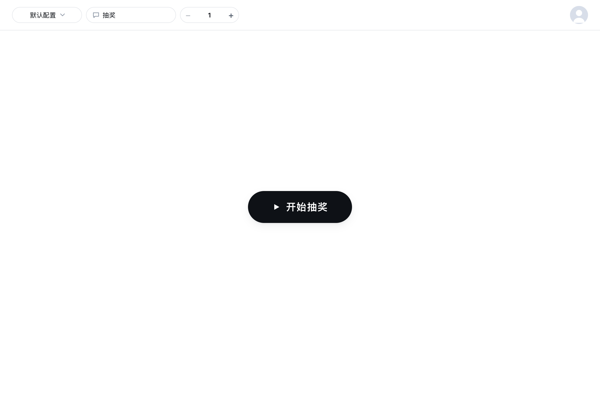
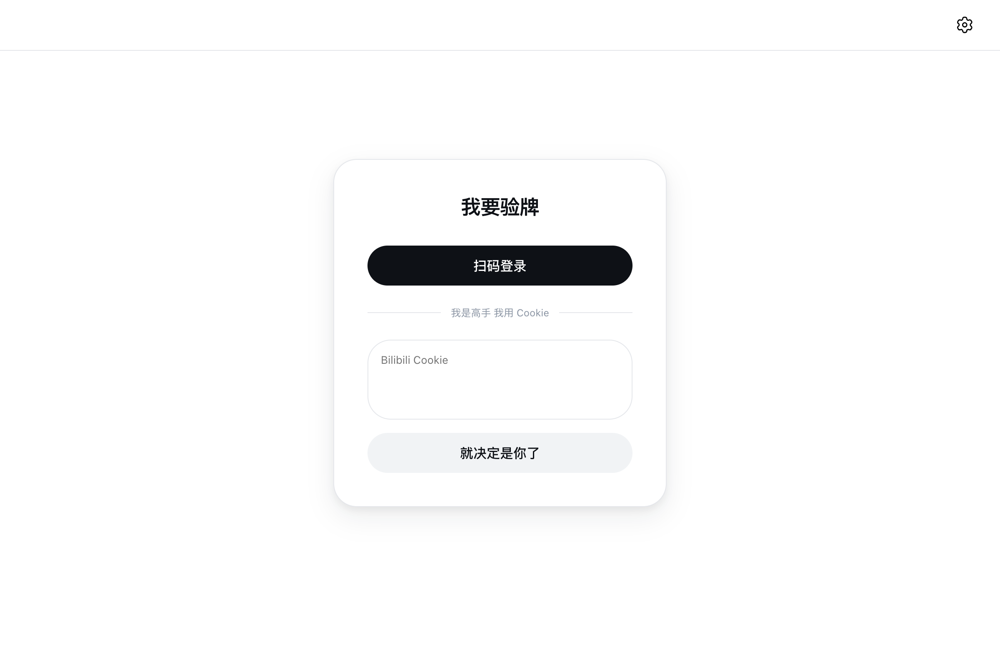
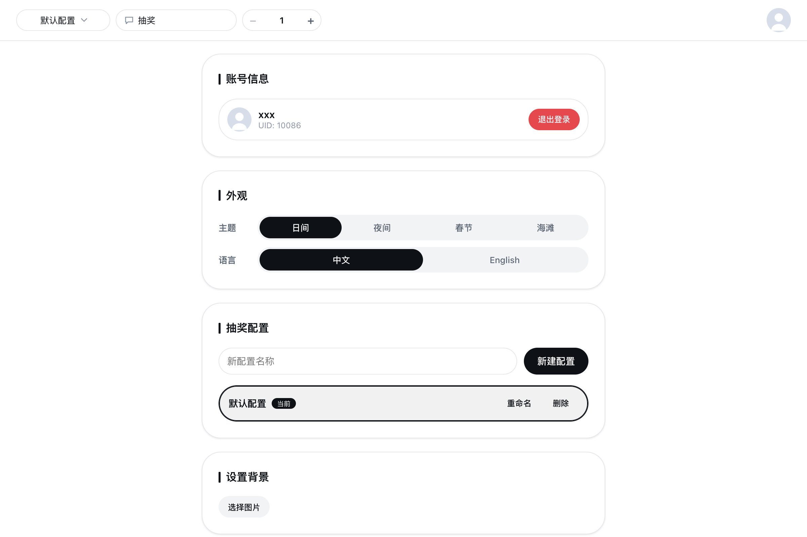
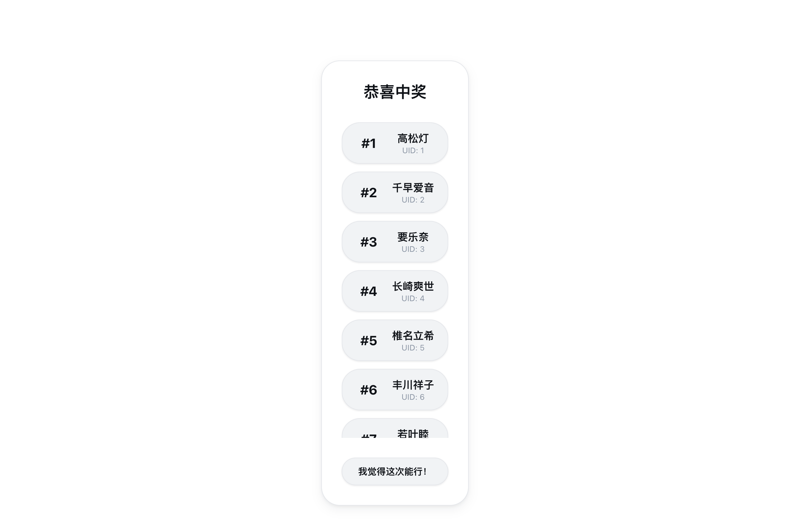

<div align="center">
  

  # BiliLuckyDraw

  基于 Wails v3 + Go + React + TypeScript 的 B 站直播间弹幕抽奖桌面应用

  
  
  
  
  

  **[简体中文](./docs/README.zh-CN.md)** · **[English](./docs/README.en-US.md)**
</div>

---

> 完整文档见 [在线文档](https://adarkmaker.github.io/BiliLuckyDraw/)（或上方语言链接）。简要说明如下。

## 功能特性

- **直播间抽奖**：实时监控弹幕，按关键词收集参与用户，随机抽奖
- **多种登录方式**：Cookie 登录、B 站 APP 扫码登录
- **多 Profile**：多套抽奖配置（关键词 / 中奖数 / 监控房间），一键切换
- **主题系统**：日间（默认，跟随系统）、夜间、春节、海滩四套主题，运行时可切换
- **可定制**：自定义关键词、监控房间、背景图

## 截图预览

<div align="center">
  <table>
    <tr>
      <td align="center"><br/><sub>首页 / 抽奖页</sub></td>
      <td align="center"><br/><sub>登录页</sub></td>
      <td align="center"><br/><sub>扫码登录</sub></td>
    </tr>
    <tr>
      <td align="center"><br/><sub>设置页</sub></td>
      <td align="center"><br/><sub>中奖结果</sub></td>
    </tr>
  </table>
</div>

## 下载

[](https://github.com/aDarkMaker/BiliLuckyDraw/releases)

## 快速开始

1. 从 [Releases](https://github.com/aDarkMaker/BiliLuckyDraw/releases) 下载对应平台的安装文件
2. 使用 Cookie 或扫码登录
3. 在设置页添加要监控的直播间
4. 点击开始，实时监控弹幕并收集参与用户

## 技术栈

| 层 | 技术 |
| --- | --- |
| 后端 | Wails v3 · Go 1.25 |
| 前端 | React 18 · TypeScript 5 · Vite · Bun |
| 通信 | WebSocket · Gorilla |

## 开发

```bash
git clone https://github.com/aDarkMaker/BiliLuckyDraw.git
cd BiliLuckyDraw/luckydraw
task common:install:frontend:deps   # 安装前端依赖
task dev                            # 开发模式（热重载）
task build                          # 构建当前平台可执行文件
```

> 详细开发与构建说明见 [完整文档](./docs/README.zh-CN.md#开发与构建)。

## 许可证

[MIT License](../LICENSE) © 2025 aDarkMaker
