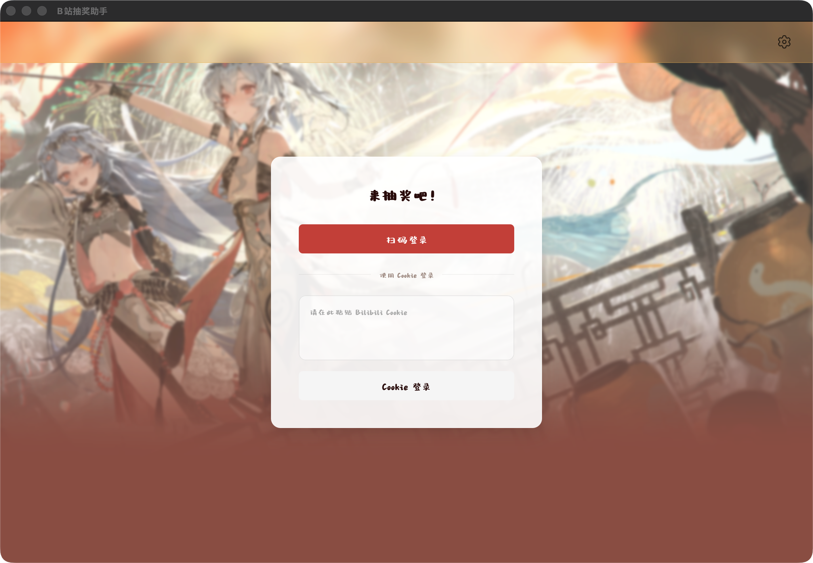
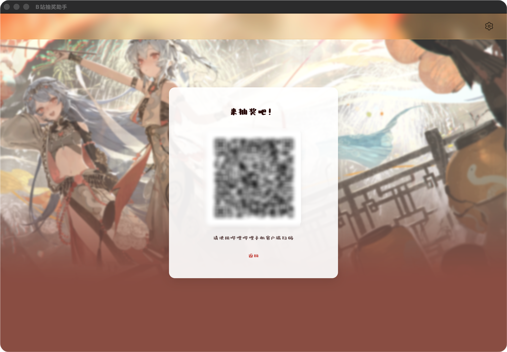

# BiliLuckyDraw

一款可以定制化的B站直播抽奖机

## Features

- Live room lottery: Monitor live room danmaku and draw winners based on keywords
- Login: Support Cookie login and QR code login
- Auto lottery: Automatically search and participate in dynamic lotteries
- Configurable: Custom keywords, watched rooms, wait times and other parameters

## Screenshots

### Login:


### QR Code Login:


### Main Interface:


### Settings:


## How to use?

- Download ```.exe``` (Wait for resources of image)
- Login and Config
- Set Key Words
- Start!

## Stack

- **Backend:** Wails + Go
- **Frontend:** React + TypeScript + Vite
- **Core:** WebSocket & Gorilla

## Dev && Build

### Environment:
- Go
- Node.js / Bun
- Wails CLI

### Local:

```bash
git clone https://github.com/aDarkMaker/BiliLuckyDraw.git
cd luckydraw
```

#### Init:

```bash
cd frontend && bun install
```

#### Dev:

```bash
cd .. && bash dev.sh # If Mac
cd .. && wails dev # If Windows
```

#### Build:

```bash
cd .. && bash build.sh # If Mac
cd .. && wails build # If Windows
```

## TODO List

1. Custom components
2. Icon

## DevLog

- 2025.12.26:
  - 修复了 Windows 平台头像无法解析的 Bug
  - 完成了基础开发
  - 修正了设置人数框的交互逻辑

- 2026.1.14:
  - 修改了文字描述
  - 修改了CSS代码位置
