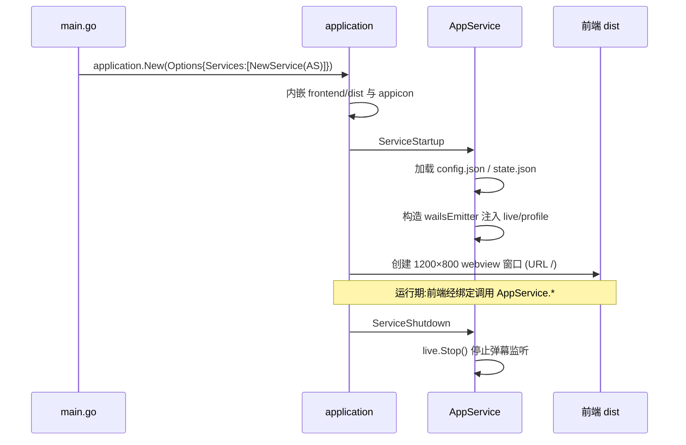
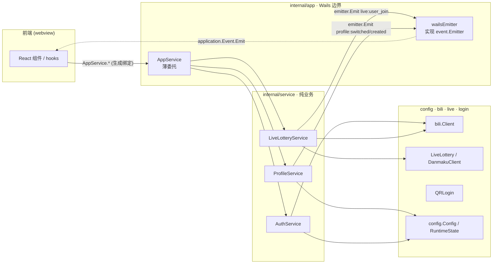

# 后端架构

## 入口 main.go

`application.New` 注册一个服务 `application.NewService(app.New())`，内嵌前端 dist 与应用图标，创建 1200×800 webview 窗口（URL `/`），macOS 关闭最后一个窗口即退出。

## app 层（Wails 边界）

`AppService` 是暴露给前端的唯一服务，持有 `auth`/`live`/`profile` 三个 service impl 与 `app *application.App`。

- `ServiceStartup`：加载 `~/.luckydraw/config.json` 与 `state.json`，通过 `application.Get()` 获取 app，构造 `wailsEmitter`，注入 `live`/`profile` service（`auth` 不注入）。
- `ServiceShutdown`：调用 `live.Stop()`。
- `ServiceName`：返回 `"App"`。

`wailsEmitter` 实现 `event.Emitter` 接口，委托 `application.App.Event.Emit`，让 service 不直接依赖 Wails。每个导出方法薄委托对应 service，签名不变。

`app` 层向 `live`/`profile` 注入 `Emitter`（`auth` 不需要事件），service 通过它发事件，由 `wailsEmitter` 转发回前端——service 全程不 import Wails。

## service 层（纯业务）

| Service | 依赖 | 事件 |
| --- | --- | --- |
| `AuthService` | `*bili.Client`、`*config.Config`、configPath | 无（autoLogin 时校验 Cookie） |
| `LiveLotteryService` | `*live.LiveLottery`、`Emitter`、`func()*bili.Client` | `live:user_join` |
| `ProfileService` | `*config.RuntimeState`、statePath、`Emitter` | `profile:switched`、`profile:created` |

- `LiveLotteryService.StartLiveLottery` 设置 `liveLottery.OnUserJoin` 回调，回调内 `emitter.Emit("live:user_join", user)`。
- `ProfileService` 的 `SwitchProfile`/`CreateProfile` 持久化后发事件。Profile ID 格式 `pf_%d`（`time.Now().UnixNano()`）。

## event / domain

- `event.Emitter` 接口：`Emit(name string, data ...any) bool`，由 `app.wailsEmitter` 实现。
- `domain` 定义 `AuthService`/`LiveLotteryService`/`ProfileService` 接口 + `AccountInfo` DTO，契约文档作用。

## config

| 类型 | 内容 | 文件 |
| --- | --- | --- |
| `Config` | `{Cookie}` | `~/.luckydraw/config.json` |
| `RuntimeState` | `{Profiles, ActiveProfile}` | `~/.luckydraw/state.json` |
| `ProfileConfig` | `{ID, Name, BackgroundImage, WatchedRooms, Keyword, WinnerCount}` | （state.json 内） |

`migrateOldState` 兼容旧版单 Profile 格式。

## bili / live / login

- `bili`：B 站 HTTP API 客户端（`Client`、`GetMyInfo` → `UserInfo{Mid,Name,Face}`、`DefaultHTTPClient`）。
- `live`：直播弹幕 WebSocket 二进制协议（`DanmakuClient`，重连/退避、16 字节包帧、`OperationJoin` 鉴权、心跳）+ 抽奖聚合（`LiveLottery`，`OnUserJoin` 回调、`Draw` Fisher-Yates 洗牌、按 UID 去重的参与者池）。类型：`DanmakuUser{UID,Username,Count}`、`DanmakuMessage`。
- `login`：B 站扫码登录流程（`QRLogin.GetQRCode`、`CheckQRCodeStatus` 轮询；状态码 0 成功 / 86038 过期 / 86090 已扫码待确认）。

## 前端可见方法

`AppService` 暴露给前端的全部方法，前端经生成绑定调用。

| 方法 | 职责 | 说明 |
| --- | --- | --- |
| `Login` | auth | Cookie 登录，调 GetMyInfo 校验后持久化 |
| `LoginWithQRCode` | auth | 用扫码收集的 Cookie 完成登录 |
| `GetQRCode` | auth | 申请二维码，返回 qrcode_key 与 url |
| `CheckQRCodeStatus` | auth | 轮询扫码状态（0/86038/86090） |
| `IsLoggedIn` | auth | 是否已登录 |
| `GetAccountInfo` | auth | 当前账号信息（name/uid/face） |
| `Logout` | auth | 登出并清空 Cookie |
| `ConnectLiveRooms` | live | 连接监控房间的弹幕 WebSocket |
| `StartLiveLottery` | live | 开始监听，设 OnUserJoin 回调 |
| `StopLiveLottery` | live | 停止弹幕监听 |
| `DrawWinners` | live | 从参与者池随机抽取中奖者 |
| `GetParticipantCount` | live | 当前参与者人数 |
| `IsLiveLotteryRunning` | live | 抽奖是否进行中 |
| `GetProfiles` | profile | 列出全部 Profile 与激活项 |
| `SwitchProfile` | profile | 切换激活 Profile |
| `CreateProfile` | profile | 新建 Profile |
| `DeleteProfile` | profile | 删除 Profile |
| `RenameProfile` | profile | 重命名 Profile |
| `SaveProfileConfig` | profile | 保存 Profile 配置 |
| `SetBackgroundImage` | profile | 设置自定义背景图 |
| `GetBackgroundImage` | profile | 读取自定义背景图 |
| `AddWatchedRoom` | profile | 添加监控房间 |
| `RemoveWatchedRoom` | profile | 移除监控房间 |
| `GetWatchedRooms` | profile | 列出监控房间 |
