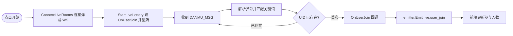
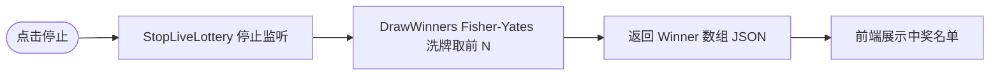
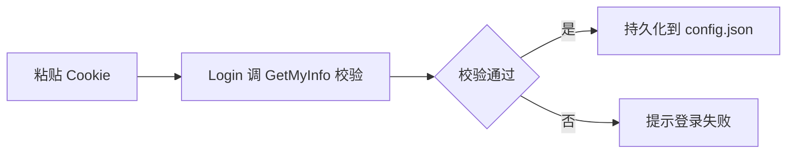
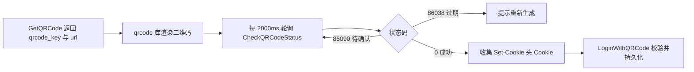
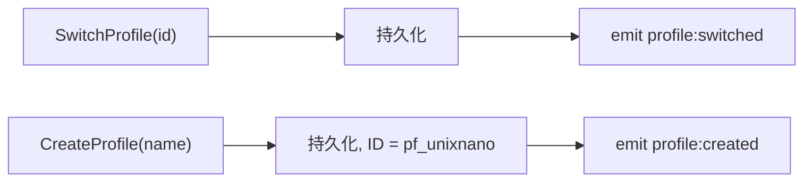

# 数据流与事件

## 抽奖流程

`live:user_join` 实时驱动参与人数更新；另有 1000ms 轮询兜底对账。

## 停止与开奖

## 登录流程

**Cookie 登录：**

**扫码登录：**

## Profile 事件

payload 均为对应 ProfileConfig JSON。

## 配置持久化

| 文件 | 内容 |
| --- | --- |
| `~/.luckydraw/config.json` | `{Cookie}` |
| `~/.luckydraw/state.json` | `{Profiles, ActiveProfile}` |

关键词与中奖数变更后 500ms 防抖自动调用 `SaveProfileConfig` 写入 `state.json`。
