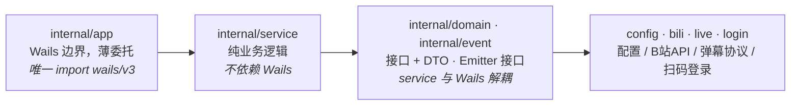

# 架构总览

BiliLuckyDraw 是一个 Wails v3 桌面应用：Go 后端通过 `//go:embed all:frontend/dist` 内嵌 React 前端构建产物，在 1200×800 的 webview 单窗口中渲染。macOS 下关闭最后一个窗口即退出应用。

## 后端分层



- `app`：唯一 import `wails/v3` 的包，`AppService` 是暴露给前端的单一服务，所有方法委托 `service`。
- `service`：纯 Go 业务逻辑，依赖 `bili`/`live`/`login`/`config`/`event`/`domain`，可单测无 Wails。
- `domain`：接口（`AuthService`/`LiveLotteryService`/`ProfileService`）+ DTO，契约文档作用。
- `event`：`Emitter` 接口，让 `service` 不直接依赖 Wails，由 `app` 层注入实现。

## 前端结构

React 18 + TypeScript 5 + Vite。通过 Wails 自动生成的 TS 绑定（`frontend/bindings/`）调用后端方法，通过 `@wailsio/runtime` 的 `Events` 订阅后端事件。主题系统与 i18n 为自建轻量实现。

## 目录结构

```
luckydraw/
  main.go                # Wails v3 入口（embed 前端 dist）
  Taskfile.yml           # 构建工作流（dev/build/package/generate）
  internal/
    app/                 # 薄 Wails 服务层，委托 service
      app.go auth.go live.go profile.go
    service/             # 纯业务逻辑（auth/live/profile）
    domain/              # 接口 + DTO
    event/               # Emitter 接口（service 与 Wails 解耦）
    config/ bili/ live/ login/   # 配置 / B站API / 弹幕协议 / 扫码登录
  frontend/
    src/
      themes/            # 主题系统（light/dark/spring-festival/beach）
      styles/            # 基础结构 token + 组件样式
      components/ hooks/
    bindings/            # wails3 generate bindings 生成（勿手改）
```
