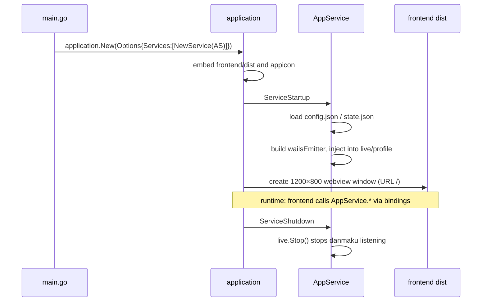

# Backend Architecture

## Entry: main.go

`application.New` registers a single service `application.NewService(app.New())`, embeds the frontend dist and app icon, and creates a 1200×800 webview window (URL `/`). On macOS, closing the last window quits the app.

## app layer (Wails boundary)

`AppService` is the single service exposed to the frontend. It holds three service impls (`auth`/`live`/`profile`) and `app *application.App`.

- `ServiceStartup`: loads `~/.luckydraw/config.json` and `state.json`, obtains the app via `application.Get()`, builds a `wailsEmitter`, and injects it into the `live`/`profile` services (`auth` is not injected).
- `ServiceShutdown`: calls `live.Stop()`.
- `ServiceName`: returns `"App"`.

`wailsEmitter` implements the `event.Emitter` interface, delegating to `application.App.Event.Emit` so services never import Wails directly. Each exported method thinly delegates to its service impl with an unchanged signature.

```mermaid
flowchart LR
    subgraph FE["Frontend (webview)"]
        UI[React components / hooks]
    end

    subgraph APP["internal/app · Wails boundary"]
        AS["AppService<br/>thin delegation"]
        WE["wailsEmitter<br/>implements event.Emitter"]
    end

    subgraph SVC["internal/service · pure business"]
        Auth[AuthService]
        Live[LiveLotteryService]
        Profile[ProfileService]
    end

    subgraph BASE["config · bili · live · login"]
        Bili[bili.Client]
        LLive[LiveLottery / DanmakuClient]
        QR[QRLogin]
        Cfg[config.Config / RuntimeState]
    end

    UI -- "AppService.* (generated bindings)" --> AS
    AS --> Auth
    AS --> Live
    AS --> Profile
    Live -- "emitter.Emit live:user_join" --> WE
    Profile -- "emitter.Emit profile:switched/created" --> WE
    WE -. "application.Event.Emit" .-> UI
    Auth --> Bili
    Live --> LLive
    Live --> Bili
    Profile --> Cfg
    Auth --> Cfg
```

The `app` layer injects an `Emitter` into `live`/`profile` (`auth` needs no events); services emit through it and `wailsEmitter` forwards back to the frontend — services never import Wails.

## service layer (pure business)

| Service | Dependencies | Events |
| --- | --- | --- |
| `AuthService` | `*bili.Client`, `*config.Config`, configPath | none (validates Cookie on autoLogin) |
| `LiveLotteryService` | `*live.LiveLottery`, `Emitter`, `func()*bili.Client` | `live:user_join` |
| `ProfileService` | `*config.RuntimeState`, statePath, `Emitter` | `profile:switched`, `profile:created` |

- `LiveLotteryService.StartLiveLottery` sets the `liveLottery.OnUserJoin` callback, which calls `emitter.Emit("live:user_join", user)`.
- `ProfileService.SwitchProfile`/`CreateProfile` persist then emit. Profile ID format is `pf_%d` (`time.Now().UnixNano()`).

## event / domain

- `event.Emitter` interface: `Emit(name string, data ...any) bool`, implemented by `app.wailsEmitter`.
- `domain` defines the `AuthService`/`LiveLotteryService`/`ProfileService` interfaces + the `AccountInfo` DTO; serves as a contract document.

## config

| Type | Contents | File |
| --- | --- | --- |
| `Config` | `{Cookie}` | `~/.luckydraw/config.json` |
| `RuntimeState` | `{Profiles, ActiveProfile}` | `~/.luckydraw/state.json` |
| `ProfileConfig` | `{ID, Name, BackgroundImage, WatchedRooms, Keyword, WinnerCount}` | (inside state.json) |

`migrateOldState` handles the legacy single-Profile format.

## bili / live / login

- `bili`: Bilibili HTTP API client (`Client`, `GetMyInfo` → `UserInfo{Mid,Name,Face}`, `DefaultHTTPClient`).
- `live`: live-stream danmaku WebSocket binary protocol (`DanmakuClient`, reconnect/backoff, 16-byte packet framing, `OperationJoin` auth, heartbeat) + draw aggregation (`LiveLottery`, `OnUserJoin` callback, `Draw` Fisher-Yates shuffle, UID-deduped participant pool). Types: `DanmakuUser{UID,Username,Count}`, `DanmakuMessage`.
- `login`: Bilibili QR-code login flow (`QRLogin.GetQRCode`, `CheckQRCodeStatus` polling; status `0` success / `86038` expired / `86090` scanned, awaiting confirmation).

## Frontend-visible methods

All methods `AppService` exposes to the frontend; called via generated bindings.

| Method | Area | Description |
| --- | --- | --- |
| `Login` | auth | Cookie login; validates via GetMyInfo and persists |
| `LoginWithQRCode` | auth | Complete login with the Cookie collected from a QR scan |
| `GetQRCode` | auth | Request a QR code; returns qrcode_key and url |
| `CheckQRCodeStatus` | auth | Poll scan status (0/86038/86090) |
| `IsLoggedIn` | auth | Whether logged in |
| `GetAccountInfo` | auth | Current account info (name/uid/face) |
| `Logout` | auth | Log out and clear the Cookie |
| `ConnectLiveRooms` | live | Connect danmaku WebSockets for watched rooms |
| `StartLiveLottery` | live | Start listening; set the OnUserJoin callback |
| `StopLiveLottery` | live | Stop danmaku listening |
| `DrawWinners` | live | Draw winners at random from the participant pool |
| `GetParticipantCount` | live | Current participant count |
| `IsLiveLotteryRunning` | live | Whether a draw is in progress |
| `GetProfiles` | profile | List all profiles and the active one |
| `SwitchProfile` | profile | Switch the active profile |
| `CreateProfile` | profile | Create a new profile |
| `DeleteProfile` | profile | Delete a profile |
| `RenameProfile` | profile | Rename a profile |
| `SaveProfileConfig` | profile | Save profile config |
| `SetBackgroundImage` | profile | Set a custom background image |
| `GetBackgroundImage` | profile | Read the custom background image |
| `AddWatchedRoom` | profile | Add a watched room |
| `RemoveWatchedRoom` | profile | Remove a watched room |
| `GetWatchedRooms` | profile | List watched rooms |
