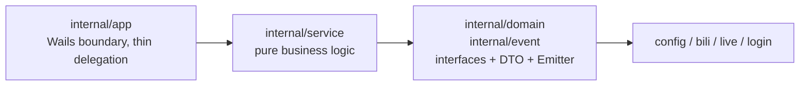

# Architecture Overview

BiliLuckyDraw is a Wails v3 desktop app: the Go backend embeds the React frontend build output via `//go:embed all:frontend/dist` and renders it in a single 1200×800 webview window. On macOS, closing the last window quits the app.

## Backend layering



- `app`: the only package importing `wails/v3`. `AppService` is the single service exposed to the frontend; every method delegates to `service`.
- `service`: pure Go business logic. Depends on `bili`/`live`/`login`/`config`/`event`/`domain`. Unit-testable without Wails.
- `domain`: interfaces (`AuthService`/`LiveLotteryService`/`ProfileService`) + DTOs; serves as a contract document.
- `event`: the `Emitter` interface keeps `service` from importing Wails directly; the implementation is injected by the `app` layer.

## Frontend

React 18 + TypeScript 5 + Vite. Calls backend methods through Wails-generated TS bindings (`frontend/bindings/`), and subscribes to backend events via `@wailsio/runtime` `Events`. The theme system and i18n are lightweight in-house implementations.

## Directory layout

```
luckydraw/
  main.go                # Wails v3 entry (embeds frontend dist)
  Taskfile.yml           # build workflow (dev/build/package/generate)
  internal/
    app/                 # thin Wails service layer, delegates to service
      app.go auth.go live.go profile.go
    service/             # pure business logic (auth/live/profile)
    domain/              # interfaces + DTO
    event/               # Emitter interface (decouples service from Wails)
    config/ bili/ live/ login/   # config / Bilibili API / danmaku protocol / QR login
  frontend/
    src/
      themes/            # theme system (light/dark/spring-festival/beach)
      styles/            # base structure tokens + component styles
      components/ hooks/
    bindings/            # generated by wails3 generate bindings (do not hand-edit)
```
